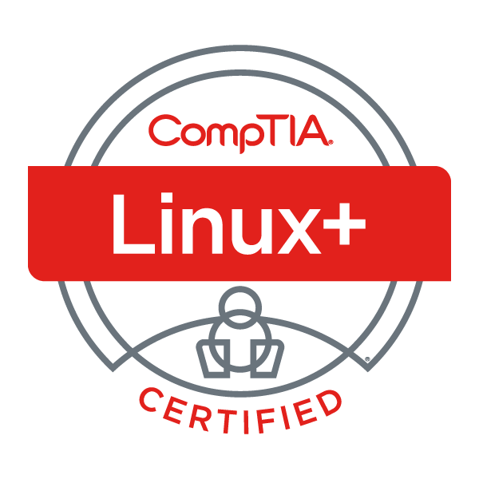

# Hi there! 👋

## 🔐 Cybersecurity Professional | 🐍 Python Developer | ☁️ AWS Enthusiast

Welcome to my GitHub profile! I'm passionate about cybersecurity, cloud security, and building secure applications with Python.

---

## 🎓 Certifications

  <table>
    <tr>
      <td align="center">
        
         <strong>Security+</strong>
      </td>
      <td align="center">
        
         <strong>Linux+</strong>
      </td>
      <td align="center">
        
         <strong>Network+</strong>
      </td>
    </tr>
    <tr>
      <td align="center">
        
         <strong>A+</strong>
      </td>
      <td align="center">
        
         <strong>IT Fundamentals+</strong>
      </td>
      <td align="center">
        
         <strong>AWS CCP</strong>
      </td>
    </tr>
    <tr>
      <td align="center">
        
         <strong>Certified Ethical Hacker</strong>
      </td>
      <td align="center">
        
         <strong>Cisco Technical</strong>
      </td>
      <td></td>
    </tr>
  </table>

*Comprehensive IT and Cybersecurity certifications spanning infrastructure, networking, cloud, and ethical hacking*

---

## 🛠️ Technologies & Tools

### Security & Compliance
- **Frameworks**: NIST Cybersecurity Framework
- **Tools**: Nessus, Wireshark, Metasploit, Burp Suite, Nmap, Nessus
- **Ethical Hacking**: Penetration Testing, Vulnerability Assessment, Social Engineering
- **Areas**: Incident Response, Risk Management, Security Auditing

### Networking & Infrastructure
- **Protocols**: TCP/IP, DNS, DHCP, VPN, VLAN, BGP, OSPF
- **Hardware**: Cisco Routers/Switches, Firewalls, Load Balancers
- **Linux Systems**: Ubuntu, CentOS, Red Hat, System Administration
- **Windows**: Active Directory, Group Policy, PowerShell

### Programming & Development
- **Languages**: Python 🐍, Bash, PowerShell, SQL
- **Libraries**: **place libraries here !!**
- **Focus**: Security Automation, Network Analysis, Penetration Testing Scripts

### Cloud & Infrastructure
- **AWS Services**: EC2, S3, VPC, IAM, CloudTrail, GuardDuty, Security Hub
- **Cloud Security**: CSPM, Identity Management, Compliance Monitoring
- **Infrastructure**: Docker, Kubernetes, Terraform, CloudFormation

---

## 🚀 Featured Projects

### 🔍 [Penetration Testing Toolkit](link-to-repo)
Comprehensive ethical hacking tools and scripts for penetration testing, vulnerability assessment, and security auditing.

### 🖥️ [Network Analysis Scripts](link-to-repo)
Python and Bash scripts for network monitoring, traffic analysis, and troubleshooting using Wireshark and custom tools.

### 🐧 [Linux System Hardening](link-to-repo)
Automated scripts and configurations for securing Linux systems following industry best practices and compliance standards.

### ☁️ [AWS Security Infrastructure](link-to-repo)
CloudFormation templates and Terraform modules for implementing secure AWS architectures and compliance frameworks.

---

## 📊 GitHub Stats

  

  

---

## 🌟 What I'm Working On

- 🔐 Developing advanced penetration testing tools and methodologies
- 🐧 Creating Linux system administration and hardening automation scripts  
- 🌐 Building network monitoring and analysis solutions
- ☁️ Implementing AWS security architectures and compliance frameworks
- 📚 Continuously expanding knowledge in emerging cybersecurity threats and technologies
- 🤝 Contributing to open-source security and networking projects

---

## 📝 Latest Blog Posts & Articles- **Under construction**

<!-- BLOG-POST-LIST:START -->
- [Advanced Penetration Testing with Python and Kali Linux](#)
- [AWS Security: From Cloud Practitioner to Security Architect](#)
- [Linux Hardening: Essential Commands and Configurations](#)
- [Network Analysis: Wireshark Tips and Packet Capture Best Practices](#)
<!-- BLOG-POST-LIST:END -->

---

## 🤝 **under construction**

- 🌐 [Portfolio Website](https://yourwebsite.com)

---

## 💡 Fun Facts

- 🔒 Believe in ethical hacking to make systems more secure
- 🐧 Linux enthusiast who loves the command line and automation
- 🌐 Network packets tell the best stories about system behavior
- 🐍 Python is my Swiss Army knife for security and automation tasks
- ☁️ Passionate about secure cloud architectures and compliance
- 🎯 Always looking to bridge the gap between security theory and practical implementation

---

  
  **"Security is not a product, but a process."** - Bruce Schneier
  

<!---
monachy92/monachy92 is a ✨ special ✨ repository because its `README.md` (this file) appears on your GitHub profile.
You can click the Preview link to take a look at your changes.
--->
